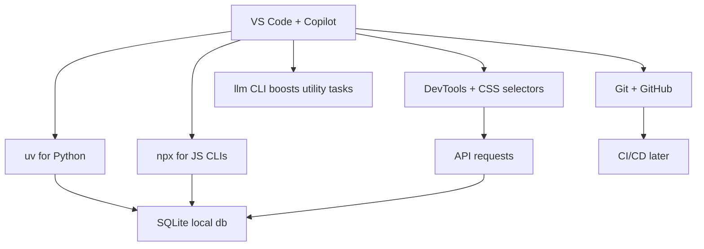

## Development Tools — TA Notes (Concise + Practical)

Use these as working notes. Skim bold lines and tables, copy the snippets, and follow the checklists when setting up.

### Editor: VS Code
- **Why it matters**: Industry default; fastest path from idea → running code.
- **Core moves**:
  - Command Palette: Ctrl/Cmd+Shift+P
  - Go to Definition: F12; Symbol: Ctrl/Cmd+T; Rename: F2
  - Integrated Terminal: Ctrl/Cmd+` (backtick)
  - Debug basics: breakpoints, Step Over (F10), Step Into (F11)
  - Source Control: stage (S), commit, branch, resolve diffs
- **Setup must-haves**: Python, Pylance, Jupyter, Ruff; ESLint, Prettier; GitLens.
- **Pitfalls**: Mixed tabs/spaces, inconsistent line endings, unchecked formatter on save.

Video takeaways (Intro + Code Editing + Debugging + Version Control):
- Learn the debug views: Variables, Watch, Call Stack, Breakpoints.
- Launch configs live in `.vscode/launch.json` (per project).
- Git panel: stage hunks/lines, view diffs, create branches quickly.
- Extensions are per-user, per-workspace settings override user.

Cheatsheet mini:
```json
// .vscode/settings.json
{
  "editor.formatOnSave": true,
  "files.eol": "\n",
  "python.analysis.typeCheckingMode": "basic"
}
```

---

### AI Editors: GitHub Copilot (+ peers)
- **Use**: Completions for speed; Chat for refactor/tests/docs.
- **Prompting**: Include file snippet + goal + constraints. Ask for tests + edge cases.
- **Model swapping**: Prefer coding-tuned models for refactors; reasoning models for design.
- **Ethics**: You own review; check licenses for generated code patterns.

Video takeaways (Getting started):
- Accept/Reject quickly to steer the model; select block → "Explain/Refactor this".
- Chat tools can run commands, open files, and propose diffs (depending on IDE).

Quick prompts:
```text
"Refactor this function into smaller pure functions and add pytests."
"Explain the time complexity and possible edge cases in this code."
```

**Alternative AI Editors**: Cursor, Windsurf, Roo Code, Cline, Continue.dev
- Most built on VS Code; standard in developer toolkit
- GitHub Copilot free tier: 2,000 completions + 50 chats
- Most built on VS Code; standard in developer toolkit
- GitHub Copilot free tier: 2,000 completions + 50 chats

---

### uv (Python project + runtime manager)
- **Replaces**: pip, venv, pipx, poetry, pyenv, twine.
- **Locking**: `uv.lock` for reproducible installs.
- **Inline deps**: script metadata means no `requirements.txt`.

Core commands:
```bash
uv run app.py               # Auto-manage Python + deps
uv run --python 3.11 app.py # Pin version
uv venv                      # Create .venv
uv pip install httpx         # Install within uv env
uvx llm 'Say hello'          # Run tool without install
```

**Inline Script Metadata** (eliminates requirements.txt):
```python
# /// script
# requires-python = ">=3.11"
# dependencies = [
#   "httpx",
#   "pandas",
# ]
# ///
```

**Useful uvx tools**:
```bash
uvx --from jupyterlab jupyter-lab   # Jupyter notebook
uvx marimo      # Interactive notebook
uvx llm         # Chat with LLMs from command line
uvx openwebui   # Chat with LLMs via browser
uvx httpie      # Make HTTP requests
uvx datasette   # Browse SQLite databases
uvx markitdown  # Convert PDF to Markdown
uvx yt-dlp      # Download YouTube videos
uvx asciinema   # Record terminal and play it
```

**Inline Script Metadata** (eliminates requirements.txt):
```python
# /// script
# requires-python = ">=3.11"
# dependencies = [
#   "httpx",
#   "pandas",
# ]
# ///
```

**Useful uvx tools**:
```bash
uvx --from jupyterlab jupyter-lab   # Jupyter notebook
uvx marimo      # Interactive notebook
uvx llm         # Chat with LLMs from command line
uvx openwebui   # Chat with LLMs via browser
uvx httpie      # Make HTTP requests
uvx datasette   # Browse SQLite databases
uvx markitdown  # Convert PDF to Markdown
uvx yt-dlp      # Download YouTube videos
uvx asciinema   # Record terminal and play it
```

Video takeaways (Inline script metadata):
- Metadata lives at the top of scripts; supports Python version + deps lists.
- `uvx` bridges one-off CLI tools for notebooks/CLI experiments.

Exam asks (likely):
- Differences vs conda/poetry; why uv is faster and simpler.
- Purpose of `uv.lock` and inline metadata.

---

### npx (Run JS CLIs without install)
- **Why**: Always-fresh tools; no global clutter.
- **Patterns**:
```bash
npx prettier --write .
npx eslint .
npx http-server .
npx esbuild app.js
npx typescript-node script.ts
npx prettier@3.6 --write .   # pin version
```

**Common use cases for data scientists**:
- JavaScript-based data visualization tools
- Converting notebooks and documents
- Testing and formatting code
- Running development servers

**Security note**: Online scripts can run arbitrary code; pin versions or review sources.

Video takeaways (What you can do with npx):
- Prefer pinning versions for reproducibility.
- CI-friendly: runs exact versions in pipelines.

---

### Unicode & Encodings
- **Theory**: ASCII < UTF-8 (dominant) < UTF-16/32. BOM can cause issues.
- **Practice**: Always specify `encoding='utf-8'` when reading/writing.
- **Symptoms**: replacement chars, garbled accents, CSV load errors.

**Character Encodings**:
- ASCII (7-bit): Limited to 128 characters, English-only
- UTF-8: Variable-width encoding, backwards compatible with ASCII
- UTF-16: Fixed-width encoding, used in Windows and Java
- UTF-32: Fixed-width encoding, memory inefficient but simple

Examples:
```python
with open('file.txt', encoding='utf-8') as f:
    text = f.read()

import pandas as pd
pd.read_csv('data.csv', encoding='utf-8', errors='replace')
```

Detection (best-effort):
```python
import chardet
enc = chardet.detect(open('unknown.txt','rb').read())['encoding']
```

Video takeaways (Code Pages & BOM):
- UTF-8 without BOM is the safe default; mismatches lead to mojibake.
- Windows tools may default to legacy code pages—override explicitly.

Exam quick hits:
- Explain BOM and why it's often undesirable in UTF-8.
- How to fix a mis-decoded CSV import in pandas.

---

### Chrome DevTools
- **Use**: Inspect DOM/CSS, test selectors, capture API calls, console debugging.
- **Console**:
```javascript
console.table(data)
console.group('g'); console.log(1); console.groupEnd('g')
copy($0)                  // copy selected node's selector
$$('a[href*="login"]')  // querySelectorAll shorthand
```
- **Network**: Copy as fetch; throttle; disable cache.
- **Elements**: Box model, CSS rules; compute final styles.

**Key Features**:
1. **Elements Panel**: Inspect/modify HTML/CSS, copy selectors, debug layout
2. **Console Panel**: JavaScript REPL, log/debug data, console methods
3. **Network Panel**: Monitor API requests, simulate slow connections, copy as fetch

**Essential Shortcuts**:
- `Ctrl+Shift+I` (Windows) / `Cmd+Opt+I` (Mac): Open DevTools
- `Ctrl+Shift+C`: Select element to inspect
- `Ctrl+L`: Clear console
- `$0`: Reference currently selected element
- `$$('selector')`: Query selector all (returns array)

Video takeaways (Intro, Shortcuts, Console, HTML vs DOM, Caching):
- Shortcuts boost speed; `$0` references the selected element.
- DOM vs HTML: dynamic changes reflected in DOM only; know inspection order.
- Caching: disable when testing; clear service worker caches too.

---

### CSS Selectors (Scraping + Styling)
- **Basics**: `div`, `.class`, `#id`, `*`
- **Attributes**: `[type="text"]`, `a[href^="https"]`, `img[alt~="logo"]`
- **Combinators**: `div > p`, `div + p`, `div ~ p`, `div p`
- **Testing**: DevTools Elements + Console `$$(selector)`

**Three main types**:
1. **Basic selectors**: element (`div`), class (`.container`), ID (`#header`), universal (`*`)
2. **Attribute selectors**: Target elements based on attributes or attribute values (`[type="text"]`)
3. **Combinators**: Use relationships between elements (`div > p`, `div + p`, `div ~ p`)

**For data scientists**: Crucial for web scraping with Beautiful Soup/Scrapy, browser automation with Selenium, styling data visualizations.

**Practice tool**: [CSS Diner](https://flukeout.github.io/) - interactive game teaching CSS selectors

Exam asks:
- Difference between child (`>`) and descendant (space) selectors.
- Attribute selectors for exact vs prefix vs contains.

---

### JSON (APIs, Configs)
- **Types**: string, number, boolean, null, array, object.
- **Gotchas**: trailing commas, unquoted keys, special characters.

**JSON Lines**: Format for storing multiple JSON objects in single lines (useful for logging/streaming)

Python + Pandas:
```python
import json, pandas as pd
obj = json.loads('{"name":"Alice"}')
json_str = json.dumps(obj, indent=2)
with open('data.json') as f: data = json.load(f)
with open('out.json','w') as f: json.dump(data, f, indent=2)

pd.read_json('data.json')                # array of objects
pd.read_json('data.jsonl', lines=True)   # JSON Lines
```

**Tools**:
- [JSONLint](https://jsonlint.com/): Validate and format JSON
- [JSON Editor Online](https://jsoneditoronline.org/): Visual JSON editor
- [JSON Schema](https://json-schema.org/): Define JSON structure
- [jq](https://stedolan.github.io/jq/): Command-line JSON processor

**Practice resources**:
- [JSON Generator](https://json-generator.com/): Create sample JSON data
- [JSON Path Finder](https://jsonpathfinder.com/): Navigate complex JSON structures

Exam asks:
- JSON Lines vs JSON array-of-objects.
- Schema validation purpose and tools.

---

### Bash (Terminal Essentials)
- **Why**: Automation, glue, data wrangling.
- **Everyday**:
```bash
ls -la; cd path; pwd; cp; mv; rm -rf
curl https://api.example.com/data | jq '.' | less
cut -d',' -f1 data.csv | sort | uniq -c
awk -F',' '{sum+=$2} END {print sum/NR}' data.csv
```
- **Script skeleton**:
```bash
#!/usr/bin/env bash
set -euo pipefail
for file in *.csv; do echo "$file"; done
```
- **Tips**: Ctrl+R search; aliases in `~/.bashrc`.

**Essential Commands**:
```bash
# File Operations
ls -la               # List all files with details
cd path/to/dir       # Change directory
pwd                  # Print working directory
cp source dest       # Copy files
mv source dest       # Move/rename files
rm -rf dir           # Remove directory recursively

# Text Processing
grep "pattern" file  # Search for pattern
sed 's/old/new/' f   # Replace text
awk '{print $1}' f   # Process text by columns
cat file | wc -l     # Count lines

# Process Management
ps aux               # List processes
kill -9 PID          # Force kill process
top                  # Monitor processes
htop                 # Interactive process viewer

# Network
curl url             # HTTP requests
wget url             # Download files
nc -zv host port     # Test connectivity
ssh user@host        # Remote login
```

**Bash Scripting Essentials**:
```bash
#!/bin/bash

# Variables
NAME="value"
echo $NAME

# Loops
for i in {1..5}; do
    echo $i
done

# Conditionals
if [ -f "file.txt" ]; then
    echo "File exists"
fi

# Functions
process_data() {
    local input=$1
    echo "Processing $input"
}
```

**Productivity Tips**:
```bash
history         # Show command history
Ctrl+R         # Search history
!!             # Repeat last command
!$             # Last argument
pushd dir      # Push directory to stack
popd           # Pop directory from stack
cd -           # Go to previous directory
```

**Useful Aliases** (add to `~/.bashrc`):
```bash
alias ll='ls -la'
alias gs='git status'
alias jupyter='jupyter notebook'
alias activate='source venv/bin/activate'
```

Video takeaways (Beginner's Guide):
- Piping and redirection are the core superpowers.
- Globbing vs regex: know when each applies.

---

### Spreadsheets: Excel + Google Sheets
- **Role**: Rapid cleaning, exploration, and pivoting before code.
- **Excel core topics (from training)**:
  - Workbooks/Worksheets; rows, columns, cells
  - Formatting: number formats, conditional formatting
  - Formulas/Functions: relative vs absolute refs, formula auditing
  - Tables: structured references; sorting, filtering
  - PivotTables: group, aggregate, drill-down, slicers
- **Common functions**:
  - Text: `LEFT`, `RIGHT`, `MID`, `TRIM`, `LEN`, `TEXTSPLIT`
  - Lookup: `VLOOKUP`, `XLOOKUP`, `MATCH` + `INDEX`
  - Aggregation: `SUMIF(S)`, `COUNTIF(S)`, `AVERAGEIF(S)`
  - Date/Time: `DATE`, `EDATE`, `EOMONTH`, `TEXT`
- **Power Query (Get & Transform)**: import CSV/Excel/Web; clean, merge, append; refresh.
- **Power Pivot**: data model, relationships, DAX basics.

Examples:
```text
XLOOKUP(lookup_value, lookup_array, return_array, [if_not_found], [match_mode])
SUMIFS(sum_range, criteria_range1, criteria1, criteria_range2, criteria2)
```

Google Sheets highlights:
- Collaboration + version history; `IMPORTRANGE`, `QUERY` function; Apps Script for automation.

Exam asks:
- Difference: `VLOOKUP` vs `XLOOKUP` (left-only vs any direction + default exact match).
- Why convert a range to a Table before building formulas.
- When to choose PivotTable vs formulas.

---

### SQLite (Databases)
- **Why**: Zero-setup, single-file DB; perfect for analysis and prototyping.

SQL snippets:
```sql
CREATE TABLE users (id INTEGER PRIMARY KEY, name TEXT, email TEXT UNIQUE);
INSERT INTO users (name,email) VALUES ('Alice','alice@example.com');
SELECT name, COUNT(*) AS cnt FROM users GROUP BY name HAVING cnt > 1;
```
Python:
```python
import sqlite3, pandas as pd
conn = sqlite3.connect('data.db')
df = pd.read_sql_query('SELECT * FROM users', conn)
conn.close()
```

**Core Concepts**:
```sql
-- Create a table
CREATE TABLE users (
    id INTEGER PRIMARY KEY,
    name TEXT NOT NULL,
    email TEXT UNIQUE,
    created_at DATETIME DEFAULT CURRENT_TIMESTAMP
);

-- Insert data
INSERT INTO users (name, email) VALUES
    ('Alice', 'alice@example.com'),
    ('Bob', 'bob@example.com');

-- Query data
SELECT name, COUNT(*) as count
FROM users
GROUP BY name
HAVING count > 1;

-- Join tables
SELECT u.name, o.product
FROM users u
LEFT JOIN orders o ON u.id = o.user_id
WHERE o.status = 'pending';
```

**Common Operations**:
```sql
-- Backup database
.backup 'backup.db'

-- Import CSV
.mode csv
.import data.csv table_name

-- Export results
.headers on
.mode csv
.output results.csv
SELECT * FROM table;

-- Create index
CREATE INDEX idx_user_email ON users(email);

-- Analyze query
EXPLAIN QUERY PLAN
SELECT * FROM users WHERE email LIKE '%@example.com';
```

**Tools**:
- [SQLiteStudio](https://sqlitestudio.pl/): Lightweight GUI
- [DBeaver](https://dbeaver.io/): Full-featured GUI
- [sqlite-utils](https://sqlite-utils.datasette.io/): CLI tool
- [Datasette](https://datasette.io/): Web interface

Exam table:
| DB | Setup | Concurrency | Use |
| --- | --- | --- | --- |
| SQLite | None (file) | Low–moderate | Local analysis, mobile/web cache |
| Postgres | Server | High | Production, complex queries |
| MySQL | Server | High | Web backends |

---

### Git + GitHub (Version Control)
- **Mental model**: Working dir → index (staged) → commits → remote.
- **Happy path**:
```bash
git init && git add . && git commit -m 'init'
git branch -M main && git remote add origin <url> && git push -u origin main
```
- **Feature branch**:
```bash
git checkout -b feature/thing
# work
git add -A && git commit -m 'feat: add thing'
git push -u origin feature/thing
```
- **Hygiene**: small PRs (<400 LOC), self-review diffs, meaningful messages.

**Essential Commands**:
```bash
# Repository Setup
git init                   # Create new repo
git clone url              # Clone existing repo
git remote add origin url  # Connect to remote

# Basic Workflow
git status                 # Check status
git add .                  # Stage all changes
git commit -m "message"    # Commit changes
git push origin main       # Push to remote

# Branching
git branch                 # List branches
git checkout -b feature    # Create/switch branch
git merge feature          # Merge branch
git rebase main            # Rebase on main

# History
git log --oneline          # View history
git diff commit1 commit2   # Compare commits
git blame file             # Show who changed what
```

**Best Practices**:
```bash
# Good commit message format
type(scope): summary

Detailed description of changes.

# Examples
feat(api): add user authentication
fix(db): handle null values in query
```

**Branching Strategy**:
- main: Production code
- develop: Integration branch
- feature/\*: New features
- hotfix/\*: Emergency fixes

**Essential Tools**:
- [GitHub Desktop](https://desktop.github.com/): GUI client
- [GitLens](https://gitlens.amod.io/): VS Code extension
- [gh](https://cli.github.com/): GitHub CLI
- [pre-commit](https://pre-commit.com/): Git hooks

Exam asks:
- Rebase vs merge (linear history vs merge commits).
- How to undo last commit (soft vs hard): `git reset --soft HEAD~1`.

---

### llm (LLM on the CLI)
- **What**: Prompt, chat, switch models, structured JSON, logs, plugins.
- **Quick start**:
```bash
llm -m gpt-4.1-nano 'Summarize tomorrow's meeting'
llm -c 'now suggest 3 action items'
llm 'Top 5 viz libs' --schema-multi 'name,description'
```
- **No-install via uv**:
```bash
uvx llm 'Translate "Hello, world" into Japanese'
```
- **Automations**:
  - `git diff | llm 'Write a concise commit message'`
  - `llm cmd 'Undo the last git commit'` (plugin `llm-cmd`)

**Key Features**:
- **Interactive prompts**: `llm '…'` — Fast shell access to any LLM.
- **Conversational flow**: `-c '…'` — Continue context across prompts.
- **Model switching**: `-m MODEL` — Use OpenAI, Anthropic, local models, and more.
- **Structured output**: `llm json` — Produce JSON for automation.
- **Logging & history**: `llm logs path` — Persist every prompt/response in SQLite.
- **Web UI**: `datasette "$(llm logs path)"` — Browse your entire history with Datasette.
- **Persistent chat**: `llm chat` — Keep the model in memory across multiple interactions.
- **Plugin ecosystem**: `llm install PLUGIN` — Add support for new models, data sources, or workflows.

**Practical Uses**:
- **Automated coding**: Generate code scaffolding, review helpers, or utilities on demand
- **Transcript processing**: Summarize YouTube or podcast transcripts using Gemini
- **Commit messages**: Turn diffs into descriptive commit messages
- **Data extraction**: Convert free-text into structured JSON for automation

---

### Putting It Together (Workflow Diagram)


New project checklist:
- Init repo, push to GitHub
- Decide env: uv + inline metadata
- Pick linter/formatter/test stack
- Store local data in SQLite first
- Add VS Code tasks + launch configs

---

### Advanced theory and tricky exam asks
- **UTF-8 vs UTF-16/32 internals**: UTF-8 is variable-width (1–4 bytes) and ASCII-compatible; UTF-16 uses surrogate pairs for code points > U+FFFF; endianness matters with UTF-16/32 and BOM.
- **Shell pitfalls**: Quoting rules (single vs double vs unquoted), pipelines with `set -euo pipefail`, subshell vs current shell when using parentheses.
- **Git correctness**: Fast-forward merges vs merge commits; when rebase rewrites history; `--no-ff` implications for PR traces.
- **Virtual envs vs system Python**: Why isolated site-packages prevent dependency hell; uv's isolation with lockfiles.
- **npx security**: Remote execution risk; pin versions and prefer known packages; CI should lock to versions.
- **DevTools timing**: The difference between DOMContentLoaded vs load events; caching and service worker effects during testing.

Exam prompts you might see:
- Explain how BOM affects CSV ingestion across Windows/Linux tools.
- Show how to safely undo the last commit without losing work and why.
- Given a broken path-dependent script, explain env vs working directory pitfalls.

#### Deep dive details

Encodings comparison:
| Encoding | Width | ASCII compat | Typical use | Pros | Cons |
| --- | --- | --- | --- | --- | --- |
| UTF-8 | 1–4 bytes | Yes | Web, Unix, APIs | Compact for Latin; ubiquitous | Variable-width parsing |
| UTF-16 | 2 or 4 bytes | No | Windows, Java | Simple for many scripts | Endianness; surrogate pairs |
| UTF-32 | 4 bytes | No | Niche tooling | Fixed width | 4x space overhead |

Explicit handling patterns:
```python
# Always specify encoding; log unknowns
with open('data.csv', encoding='utf-8', errors='replace') as f:
    raw = f.read()
```

Shell quoting rules (gotchas):
```bash
# Single quotes: literal
printf '%s\n' '$HOME'        # prints $HOME
# Double quotes: expand
printf "%s\n" "$HOME"     # prints /home/user
# Unquoted globs/split
set -euo pipefail
files=("*.csv")              # avoid accidental globbing
```

Git strategies (when to use which):
| Scenario | Merge | Rebase | Notes |
| --- | --- | --- | --- |
| Small PR, linear history desired | ➖ | ✔️ | `git rebase main` before merging |
| Long-lived feature with many merges | ✔️ | ➖ | Preserve merge context |
| Hotfix on top of release | ✔️ | ➖ | Avoid rewriting published history |

Safe undo patterns:
```bash
# Keep changes, edit commit
git reset --soft HEAD~1 && git commit -m 'better msg'
# Drop working tree changes too (dangerous)
git reset --hard HEAD~1
```

npx security checklist:
- Pin versions (`npx prettier@3.6`).
- Prefer known publishers; review README and repo.
- In CI, vendor configs; avoid remote gists.

DevTools timing and cache:
```javascript
window.addEventListener('DOMContentLoaded', () => {/* DOM ready */});
window.addEventListener('load', () => {/* all resources */});
// Disable cache while debugging: Network tab → Disable cache
```
